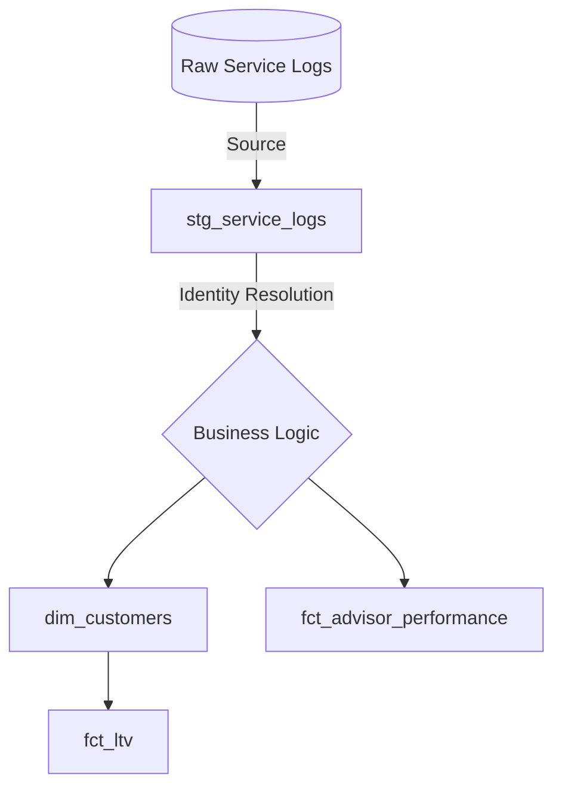

## 🏎️ SaaS Unit Economics & RevOps Migration (dbt Core)

   

## 🎯 Executive Summary
**The Context:** A traditional operational business (Honda Dealership) was running disconnected, legacy SQL scripts. The goal was to migrate their raw service logs into a **Modern Data Stack (dbt + BigQuery)** to extract SaaS-like metrics (LTV, Churn Proxy, and Operational Efficiency).

**The Challenge:** Initial legacy analysis assumed the primary key (`Referenc`) was the Customer ID. During the data auditing phase, I discovered a **critical Data Quality issue**: `Referenc` was actually a *Ticket ID*. This meant the initial churn was falsely showing as 100%.

**The Solution:** I engineered a robust **Identity Resolution** pipeline in the staging layer using a composite key (`Name + Phone`). This unlocked the ability to track true customer recurrence, segment B2B (Fleet) vs. B2C (Retail), and build actionable RevOps and Operational metrics.

---

## 🏗️ Analytics Architecture (The dbt DAG)

The project follows dbt best practices, moving data from raw operational logs to analytics-ready marts.


---
(Run dbt docs generate to view the full interactive lineage graph).
---

## 📂 Repository Structure

```bash
honda_saas_metrics/
├── models/
│   ├── staging/
│   ├── intermediate/
│   └── marts/
├── macros/
└── legacy_analysis/
```
---

## 🔄 The "Translator" Layer (SaaS Business Logic)
Translating physical operations into scalable SaaS metrics to drive Revenue Operations (RevOps).

| Operational Concept      | SaaS Equivalent        | Business Application                                   |
|--------------------------|------------------------|--------------------------------------------------------|
| Missing Phone Number     | Incomplete Profile     | Prevents re-engagement & increases Churn Risk          |
| Service Appointment      | Active User Session    | Measuring DAU/MAU (Engagement)                         |
| Morning vs. Afternoon    | Server Load            | Optimizing fixed costs during idle times               |
| Car Models               | Subscription Tiers     | Identifying High-LTV segments for upsell               |

---

## 💰 Strategic Output: Revenue Recovery Scenarios
The `fct_revenue_leakage` mart calculates recovery potential using a conservative $120 USD ARPU.

| Scenario      | Recovery Rate | Estimated Revenue Impact | Strategy Required                      |
|---------------|---------------|--------------------------|----------------------------------------|
| Pessimistic   | 5%            | $29,298                  | Passive Email Automation               |
| Realistic     | 15%           | $87,894                  | SMS + Dedicated CSM Outreach           |
| Optimistic    | 30%           | $175,788                 | Full Account Management Intervention   |

> **Note:** Previous legacy SQL scripts estimated ~$79k. However, after implementing dbt data quality tests (filtering out null IDs and negative billable hours at the staging layer), the true realistic recovery potential was validated at **$87,894 USD**.

---
## 1. Identity Resolution & Data Quality (Staging Layer)
Raw data contained missing phones and homonyms. The stg_service_logs model standardizes identities while safely handling "Ghost Users" (missing data) to prevent false aggregations.

-- Identity Resolution Snippet
*CASE
    WHEN missing_name AND missing_phone THEN 'GHOST_' || service_ticket_id
    ELSE CONCAT(COALESCE(raw_name,'UNKNOWN'), '_', COALESCE(raw_phone,'NO_PHONE'))
END AS customer_account_id*
---
## 2. Operational Intelligence (Advisor Performance)
Instead of just counting tickets, I built an Efficiency & Outlier Detection model (fct_advisor_performance).

Labor Efficiency (Upsell Proxy): Calculates avg_hours_per_ticket to identify which advisors are selling complex repairs vs. just doing high-volume, quick lube jobs.

Anomaly Detection (Z-Score): Uses Window Functions (AVG & STDDEV partitioned by advisor) to flag statistically impossible ticket durations (Z-Score > 3).

---
## 3. Lifetime Value & Customer Recurrence (Marts)
The dim_customers and fct_ltv models transform transactional tickets into a Customer-Centric Star Schema.

Maps first_service_date and last_service_date.

Creates an is_active boolean flag based on a 90-day recency threshold.

Calculates total_lifetime_hours to drive LTV forecasting.
---

## 🧠 Why This Architecture Matters (AE Perspective)

* **CI/CD Pipeline & Passwordless Auth:** Deployed a fully automated GitHub Actions workflow to run `dbt test` and `dbt build` on every push. Authenticated with Google Cloud using **Workload Identity Federation (OIDC)**—zero hardcoded JSON keys, adhering to enterprise security standards.
* **Incremental Processing:** The MRR calculation (`fct_mrr_churn.sql`) uses dbt's incremental materialization, processing only new data to minimize cloud warehouse compute costs.
* **Automated Data Quality:** The pipeline features custom SQL tests to halt execution if operational hours are negative or IDs are duplicated, preventing flawed data from reaching financial dashboards.
* **SCD Type 2 (Snapshots):** Implemented dbt snapshots to track historical changes in user tiers (e.g., upgrading from HR-V to CR-V), preserving the dimensional history.
* **DRY Code via Macros:** Complex `CASE WHEN` logic for tier valuation is centralized in a Jinja macro, making future business rule changes instant across all downstream models.

---

Author: Alejandro Diaz | Analytics Engineer
"Bridging the gap between raw operational data and scalable financial strategy."